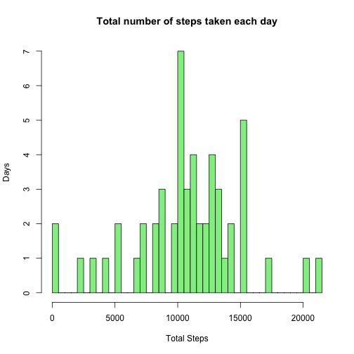
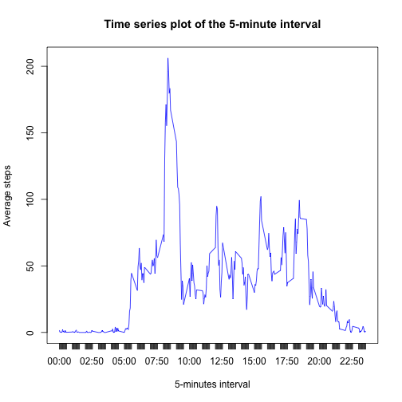
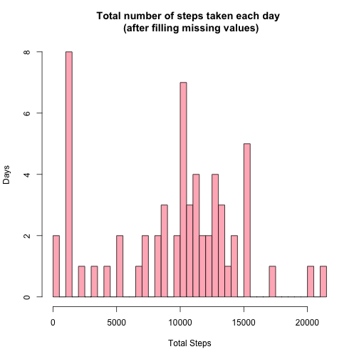
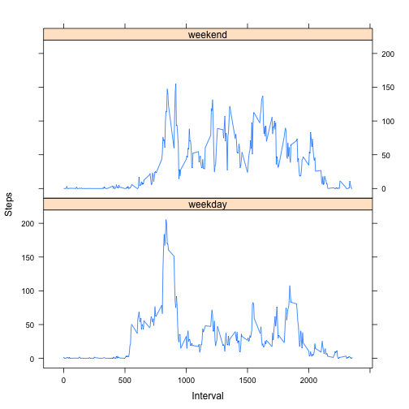

# Reproducible Research: Peer Assessment 1
Title:  PA1_template.Rmd                     ##  
Author: Ambika J                             ##  
Date:   Jul-2014                             ##  
Notes:  Reproducible Research Assignmnt 1    ##  

## Loading and preprocessing the data


```r
activity <- read.csv("activity.csv", colClasses = c("integer","character","integer"), comment="",stringsAsFactors = FALSE, nrows = 17568)
```

## What is mean total number of steps taken per day?

```r
library(reshape2)

newactivity <- activity[complete.cases(activity$steps),]
dt <- factor(as.Date(newactivity$date))
totalsteps <- melt(tapply(newactivity$steps, dt, sum))
dimnames(totalsteps)[[2]] <- c("date","total")
mn1 <- mean(totalsteps$total)
md1 <- median(totalsteps$total)
```

Total number of steps taken each day

```r
hist(totalsteps$total,breaks=50,col="lightblue",xlab='Total Steps', main = "Total number of steps taken each day")
```

 

Mean is 10766. Median is 10765.

## What is the average daily activity pattern?

```r
library(reshape2)

sumsteps <- melt(tapply(newactivity$steps,  newactivity$interval, sum))
countdates <- melt(tapply(newactivity$date, newactivity$interval, length))
merged <- merge(sumsteps,countdates, by.x = "Var1", by.y = "Var1")
averaged <- cbind(merged,merged$value.x/merged$value.y)
dimnames(averaged)[[2]] <- c("interval","totalsteps","countdates","average")

max5min <- averaged$interval[which.max(averaged$average)]
```

Time series plot of the 5-minute interval (x-axis) and the average number of steps taken, averaged across all days (y-axis)

```r
plot(averaged$average ~ averaged$interval, type = "l", xlab = "5-minute interval", ylab = "average steps",col="blue")
```

 

835 is the 5-minute interval, on average across all the days in the dataset, contains the maximum number of steps.

## Imputing missing values

```r
sum(is.na(activity$steps))
```

```
## [1] 2304
```
2304 is the total number of missing values [steps] in the dataset.

A new data set with the new strategy to fill in the missing values. Here, the NA values in step is filled with the median value for each interval.

```r
medsteps <- melt(tapply(newactivity$steps,  newactivity$interval, median))
filledData <- merge(activity,medsteps, by.x = "interval", by.y = "Var1",all = TRUE)
filledData[["steps"]][is.na(filledData[["steps"]])] <- filledData[["value"]][is.na(filledData[["steps"]])]
reorderFilledData <- filledData[order(filledData$date,filledData$interval),c(2,3,1)]
#reorderFilledData[is.na(activity[["steps"]]),] 
#tapply(reorderFilledData[["steps"]][is.na(activity[["steps"]])], reorderFilledData$date, sum)

totalfilledsteps <- melt(tapply(reorderFilledData$steps, factor(as.Date(reorderFilledData$date)), sum))
dimnames(totalfilledsteps)[[2]] <- c("date","total")
mn2 <- mean(totalfilledsteps$total)
md2 <- median(totalfilledsteps$total)
```

Total number of steps taken each day (after filling missing values)

```r
hist(totalfilledsteps$total,breaks=50,col="lightblue",xlab='Total Steps', main = "Total number of steps taken each day (after filling missing values)")
```

 

After filling the missing values, mean is 9504. Median is 10395.

Do these values differ from the estimates from the first part of the assignment? 
* YES, they do.  

What is the impact of imputing missing data on the estimates of the total daily number of steps?  
Following are the observations:  
* As median is considered to fill in the values, the mean and median has decreased by 11.7249% and 3.4371% respectively.  
* Before and After:  
Before imputing missing data mean and median is 10766 and 10765 respectively.  
After imputting missing  data mean and median is 9504 and 10395 respectively.  
* As per histogram comparison, there are about 8 days increase in the range of 1000 to 2000 total steps; which is not seen in the first part of the assignment.  
* More specific details at date level [against total steps for each date]:  

```
## 2012-10-01 2012-10-08 2012-11-01 2012-11-04 2012-11-09 2012-11-10 
##       1141       1141       1141       1141       1141       1141 
## 2012-11-14 2012-11-30 
##       1141       1141
```
 
## Are there differences in activity patterns between weekdays and weekends?

```r
reorderFilledData$date <- as.Date(reorderFilledData$date)
weekend <- weekdays(as.Date(reorderFilledData$date),TRUE) %in% c("Sat", "Sun")
reorderFilledData$day <- factor(ifelse(weekend, "weekend", "weekday"))

weekdayinterval <- reorderFilledData$interval[reorderFilledData$day == "weekday"]
weekendinterval <- reorderFilledData$interval[reorderFilledData$day == "weekend"]

#--
weekdayloc <- which(reorderFilledData$day == "weekday")
weekendloc <- which(reorderFilledData$day == "weekend")
#--

weekdayavg <- melt(tapply(reorderFilledData$steps[reorderFilledData$day == "weekday"],  weekdayinterval, mean))
weekendavg <- melt(tapply(reorderFilledData$steps[reorderFilledData$day == "weekend"],  weekendinterval, mean))

weeksmerged <- merge(weekdayavg,weekendavg,by.x="Var1",by.y="Var1")
#finalmerge <- merge(weeksmerged,avgsteps,by.x="Var1",by.y="Var1")

finalmerge1 <- merge(reorderFilledData,weeksmerged,by.x="interval",by.y="Var1")
#reorderFilledData <- filledData[order(filledData$date,filledData$interval),c(2,3,1)]
final <- finalmerge1[order(filledData$date,filledData$interval),]

final$val[weekdayloc] <- final$value.x[weekdayloc]
final$val[weekendloc] <- final$value.y[weekendloc]

final <- final[order(final$date,final$interval),] 
```

```r
library(lattice)
xyplot(val ~ interval | day, data = final, layout = c(1, 2), type="l", ylab = "steps")
```

 


