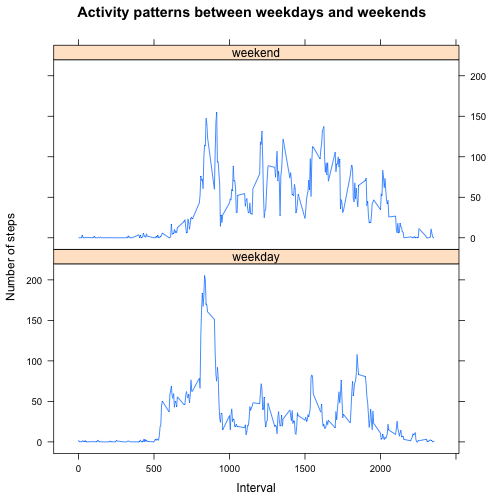

# Reproducible Research: Peer Assessment 1
Title:  PA1_template.Rmd                         

## Loading and preprocessing the data


```r
activity <- read.csv("activity.csv", colClasses = c("integer","character","integer"),
                     comment="",stringsAsFactors = FALSE, nrows = 17568)
```

## What is mean total number of steps taken per day?

```r
require(reshape2)
```

```
## Loading required package: reshape2
```

```r
require(plyr)
```

```
## Loading required package: plyr
```

```r
completeactvity <- activity[complete.cases(activity$steps),]
totalsteps <- melt(tapply(completeactvity$steps, factor(as.Date(completeactvity$date)), sum))
dimnames(totalsteps)[[2]] <- c("date","total")
mn1 <- mean(totalsteps$total)
md1 <- median(totalsteps$total)
```

#### Total number of steps taken each day

```r
### if 'breaks=50' is not specified, then in the range of 0 to 5000 steps, there is an increase 
## from 10 to 13 after imputting values for missing data. But, with "breaks=50", 
## we can clearly see that there are 8 days in the range 0 to 5000 steps, which is not present 
## before imputting values. Thus, adding breaks=50 brings in more clarity. 
## Tried with different breaks values [100, 25, etc.], but 50 would help us to compare without NAs 
## and with imputting missing values better.

hist(totalsteps$total,breaks=50,col="lightgreen",xlab='Total Steps', ylab = "Days", 
     main = "Total number of steps taken each day")
```

 

Mean is 10766. Median is 10765.

## What is the average daily activity pattern?

```r
sumsteps <- ddply(completeactvity, .(interval), summarize, sumsteps=sum(steps))
countdates <- count(completeactvity, vars = .(interval))
merged <- merge(sumsteps,countdates, by.x = "interval", by.y = "interval")
averaged <- cbind(merged,merged$sumsteps/merged$freq)
rm(list=c("sumsteps","countdates","merged"))
dimnames(averaged)[[2]] <- c("interval","totalsteps","countdates","average")

max5min <- averaged$interval[which.max(averaged$average)]

## to get it in "hrs:mins" format
max5min_time <- format(strptime(paste("2012-10-02", (max5min  %/% 100), 
                                      (max5min %% 100)),"%F%H%M"), "%H:%M")
```

#### Time series plot of the 5-minute interval (x-axis) and the average number of steps taken, averaged across all days (y-axis)

```r
plot(averaged$average ~ averaged$interval, type = "l", xlab = "5-minute interval",
     ylab = "average steps",col="blue")
```

 

```r
rm("averaged")
```

08:35 [835] is the 5-minute interval, on average across all the days in the dataset, contains the maximum number of steps.

## Imputing missing values

```r
sum(is.na(activity$steps))
```

```
## [1] 2304
```
2304 is the total number of missing values [steps] in the dataset. 
  
#### A new data set with the new strategy to fill in the missing values. Here, the NA values in step is filled with the median value for each interval.

```r
medsteps <- melt(tapply(completeactvity$steps,  completeactvity$interval, median))
filledData <- merge(activity,medsteps, by.x = "interval", by.y = "Var1",all = TRUE)
filledData[["steps"]][is.na(filledData[["steps"]])] <- filledData[["value"]][is.na(filledData[["steps"]])]
reorderFilledData <- filledData[order(filledData$date,filledData$interval),c(2,3,1)]
rm(list=c("medsteps","filledData","completeactvity"))

totalfilledsteps <- melt(tapply(reorderFilledData$steps, factor(as.Date(reorderFilledData$date)), sum))
dimnames(totalfilledsteps)[[2]] <- c("date","total")
mn2 <- mean(totalfilledsteps$total)
md2 <- median(totalfilledsteps$total)
```

#### Total number of steps taken each day (after filling missing values)

```r
### if 'breaks=50' is not specified, then in the range of 0 to 5000 steps, there is an increase 
## from 10 to 13 after imputting values for missing data. But, with "breaks=50", 
## we can clearly see that there are 8 days in the range 0 to 5000 steps, which is not present 
## before imputting values. Thus, adding breaks=50 brings in more clarity. 
## Tried with different breaks values [100, 25, etc.], but 50 would help us to compare without NAs 
## and with imputting missing values better.

hist(totalfilledsteps$total, breaks=50, col="lightpink", xlab='Total Steps', 
     main = "Total number of steps taken each day (after filling missing values)")
```

 

After filling the missing values, mean is 9504. Median is 10395.

#### Do these values differ from the estimates from the first part of the assignment? 
* YES, they do.  

#### What is the impact of imputing missing data on the estimates of the total daily number of steps?  
Following are the observations:   
  
* As median is considered to fill in the values, the mean and median has decreased by 11.7249% and 3.4371% respectively.  
* Before and After:  
Before imputing missing data mean and median is 10766 and 10765 respectively.  
After imputting missing  data mean and median is 9504 and 10395 respectively.  
* As per histogram comparison, there are about 8 days increase in the range of 1000 to 2000 total steps; which is not seen in the first part of the assignment.  
   * The dates which have missing values are 2012-10-01, 2012-10-08, 2012-11-01, 2012-11-04, 2012-11-09, 2012-11-10, 2012-11-14, 2012-11-30, i.e., there are total of 8 days. Thus, with 50 breaks, we can do a proper comparison; as displayed in the above histograms.  
   * The total number of steps less than 1500 with complete cases are 126, 41  
   * The total number of steps less than 1500 with imputting values for missing cases are 1141, 126, 1141, 1141, 1141, 1141, 1141, 1141, 41, 1141 
* More specific details at date level [against total steps for each date]:  

```
## 2012-10-01 2012-10-08 2012-11-01 2012-11-04 2012-11-09 2012-11-10 
##       1141       1141       1141       1141       1141       1141 
## 2012-11-14 2012-11-30 
##       1141       1141
```
 
## Are there differences in activity patterns between weekdays and weekends?

```r
weekend <- weekdays(as.Date(reorderFilledData$date),TRUE) %in% c("Sat", "Sun")
reorderFilledData$day <- factor(ifelse(weekend, "weekend", "weekday"))

# Average the steps on {interval and day}
dayavg <- ddply(reorderFilledData, .(interval, day), summarize, avgsteps=mean(steps))
```

```r
require(lattice)
```

```
## Loading required package: lattice
```

```r
xyplot(avgsteps ~ interval | day, data = dayavg, layout=c(1,2), type="l", xlab="Interval", ylab="Steps")
```

 


